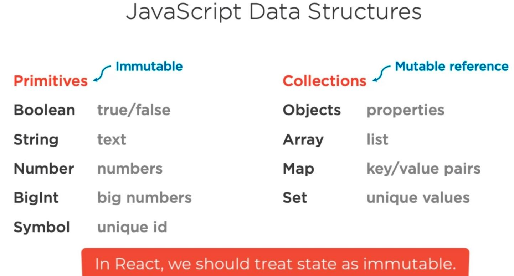
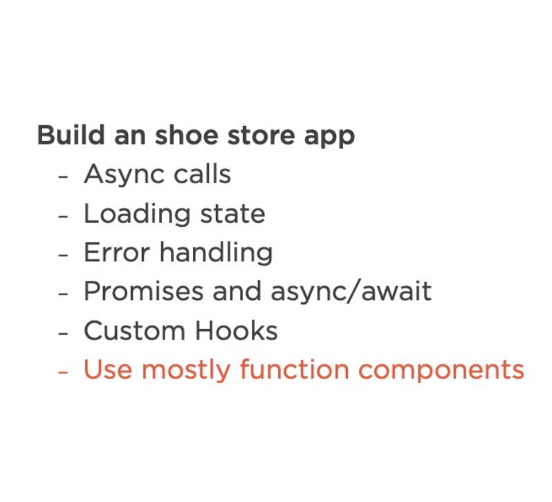

# Managing React State

## What is State?

- App data that may change over time.

## Eight Ways to Handle State in React App.

States | When to use it

1. URL: Shareable app location
2. Web storage: Perisit between sessions, one browser
3. Local state: Only one component needs the state
4. Lifted state: A few related components need the state
5. Derived state: State can be derived from existing state
6. Refs: DOM refernce, state that is not rendered
7. Context: Global or subtree state
8. Third party library: Global state, Remote State

In React app there are at least Eight different ways to handle Sate.

1. URL ( Current app location / settings )

   - Store state in url, this is usefull for tracking where the user is in the App as well as their current settings.
     Example of location related information should be stored inside the url: - Current item ( being viewed ) - Filters - Pagination - Sorting
   - Supports deep linking
     - keeping location related data in url means that users can share deep links with others.
   - Avoid redundantly storing in your app
     - To avoid the url in your app getting out of sync, its usefull to avoid storing such location information in your app state
     - Use the url is the system of record, read form it as needed for such information and update the url as needed when such settings changed.
   - Consider **React Router**
     - react-router is not a part of react, but its a popular third party library that help with above concerns. **We can use react-router to handle URL related state**.

2. Web storage

- Persist state between reloads

  - cookies, localStorage, IndexedDB (These are native browser technologies)

- Watch out (Remeber)

  - Tied to a single browser
  - Avoid storing sensitive data

- Examples when web storage is might be usefull
  - Items in shoping cart
  - Partially completed form data

3. Local state

- Store state inside a React Component
  - Usefull when once component needs the state
- Examples:
  - Forms Data
  - Toggles ( UI - Components settings )
  - Local lists

4. Lifted state

Often the same state is used by multiple components. In those cases, it's usefull to lift state to a common parent. Lifting state is a to step process.

- Lift state to a common parent ( two step process)
  1. Declare state in a parent component
  2. Pass state down via props

Note:
Use this Lifted State pattern when related components need same state.

lifting state avoids duplicating state in multiple components and thus helps assure that your components all consistently reflect the same state.

5. Derived state

- Derive state from existing state/props

Examples

- Call **.length** on an array in render
- Derive **errorsExist boolean** by checking if the errors array is empty.

why derive?

- Avoids state values getting out of sync which can lead to a bugs
- Simplifies code (When you update the state any derive values are automatically re calculated and render)

6. Refs

There are two scenarios where refs are useful:

1.  Refs can hold a **DOM Element reference**

- Uncontrolled components (Form inputs whose value is not controlled by React).
- Interfacing with non-React libraries

2. State that is not displayed

- Track if component is mounted
- Hold timer
- Store previous state value ( usefull for features like undo/redo )

7. Context
   If you have data and functions that are used by entire app or by significant portion of your APP, reacts context can be usefull.

- Avoids **prop drilling** (Passing props down to every componet that needs a given value)

Exmaples of storing data/state in react context are:

- Logged in user
- Authorization settings
- Theming ( The selected theme )
- Internationaliztion settings

8. Third party library

Handling state via third party library, few popular options includes:

- Redux
- Mobx
- Recoil

**Remote State**
There are also some specialzied state management libraries for handling data that you fetch from a API Calls.

- react-query
- Swr
- Relay (If you are using GraphQL)
- Apollo (If you are using GraphQL)

# JavaScript Data Structures

When declaring state, we also need to choose the data structure:

---

# Managing Local and Remote State.

Building Demo App:

